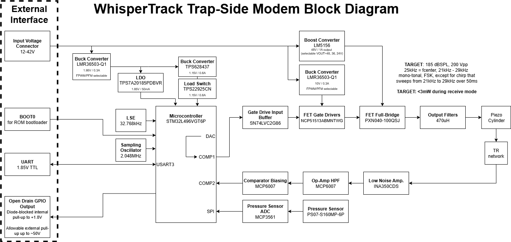
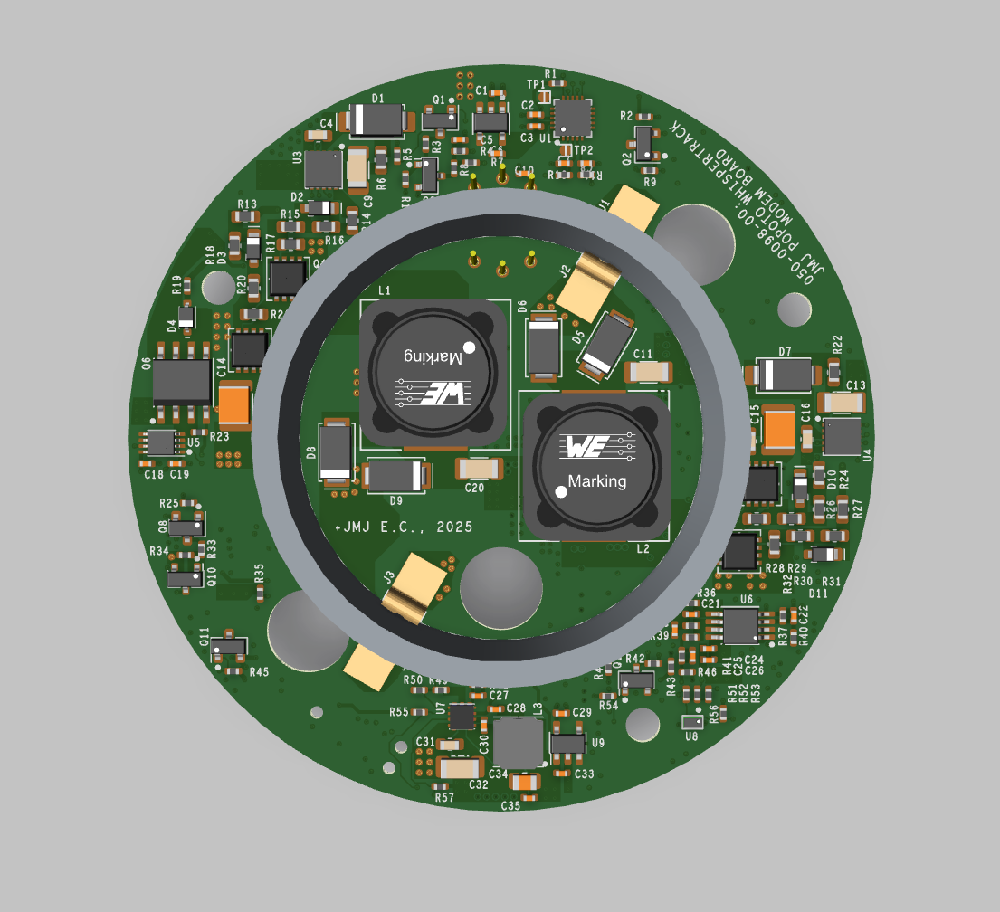
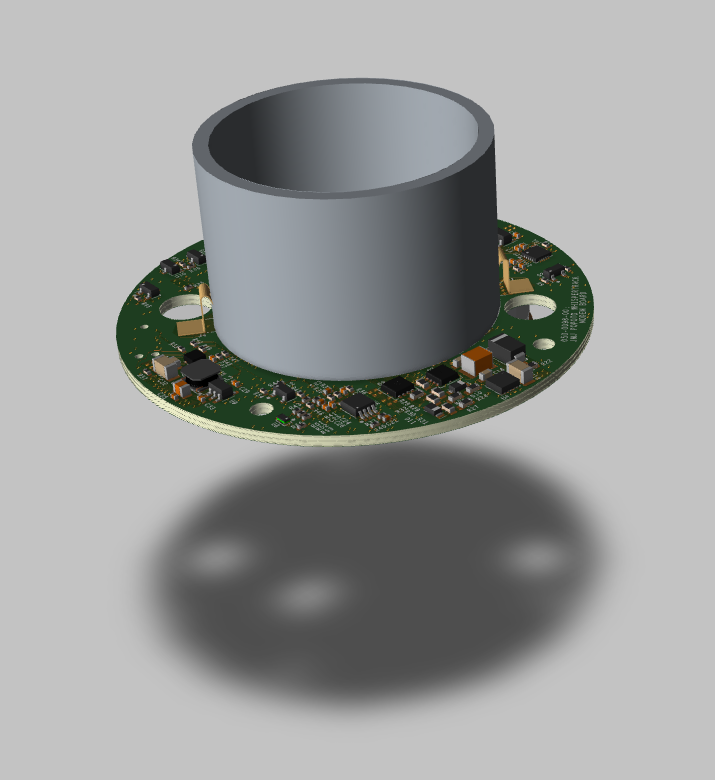
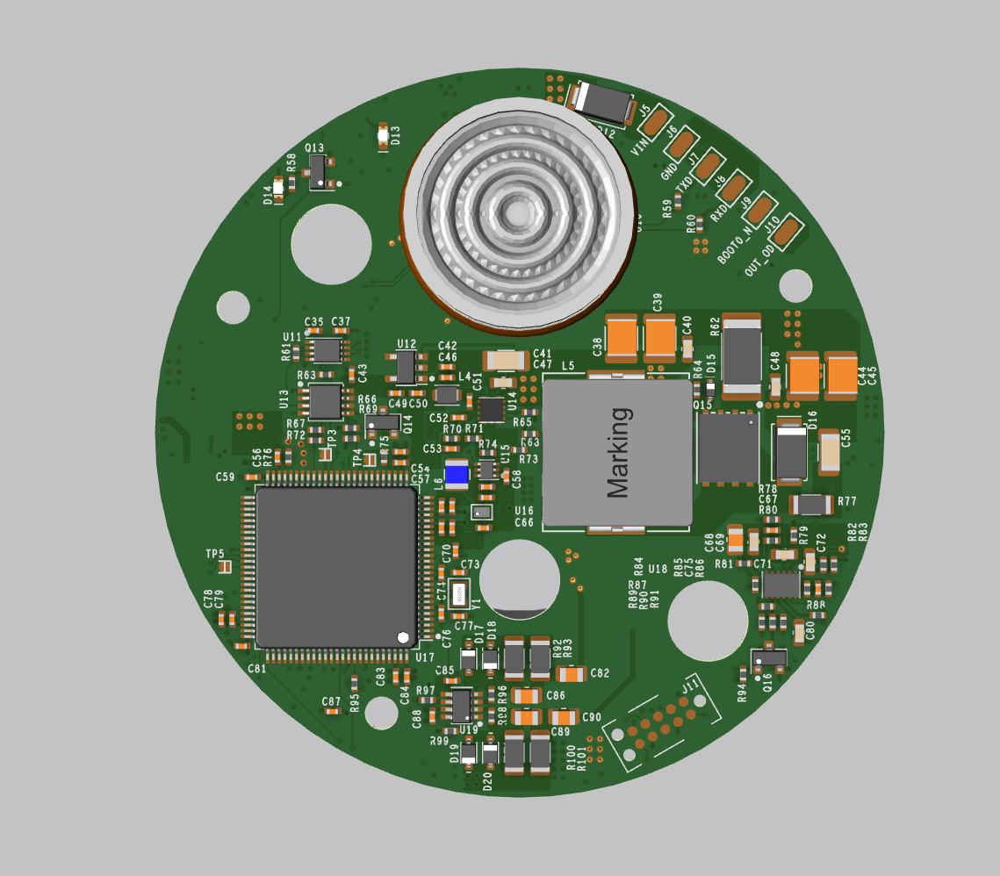
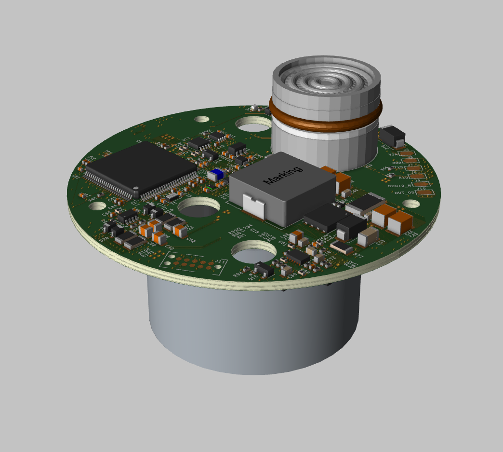

# WhisperTrack Trap-Side Hardware Overview
## WhisperTrack Trap-Side Hardware System Block Diagram

## Trap-Side Printed Circuit Board Assembly (PCBA) 3D Renderings

The above 3D renderings of the PCBA are shown with the piezoelectric tube mounted.

## External Electrical Interface

The external electrical interface of the WhisperTrack Trap-Side Modem consists of a six-conductor cable (Alpha Wire 25106 BK199). The wiring assignments are given below: 

| Conductor | Color | Function | Notes |
| -------- | ------- | ------- |------- |
| 1 | BLACK | GND | 0VDC |
| 2 | BROWN | BOOT0_N | Connect to GND before power up to put modem in ROM bootloader mode |
| 3 | RED | VIN | +12 VDC to +42 VDC |
| 4 | ORANGE | UART RXD | +1.85V logic level |
| 5 | YELLOW | UART TXD | +1.85V logic level |
| 6 | GREEN | Trigger | Diode-blocked internal pull-up to +1.85V. Allowable external pull-up to +50V |

One method to communicate with the Trap-Side Modem via UART is by using a +1.8V-logic level USB-to-UART adapter cable, such as [FTDI TTL-232RG-VREG1V8-WE](https://ftdichip.com/products/ttl-232rg-vreg1v8-we/). If using this adapter cable, then BLACK, ORANGE, & YELLOW wires can be connected directly together between the Trap-Side Modem and the adapter cable.

## Transmit Amplitude

The Trap-Side Modem's transmit amplitude is directly set by the boost converter's output voltage. The boost converter can be set to 24V, 36V, or 48V. The power consumption during transmit will change proportionally with the boost converter output voltage setting. 

## Power Consumption

Coming Soon!

## Hardware Costs

Details Coming Soon!