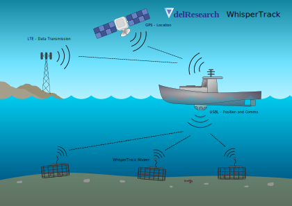

# How WhisperTrack Works
## Overview
WhisperTrack is an innovative solution designed to enhance the safety and efficiency of rope-less fishing, particularly for the North Atlantic Right Whale. By integrating advanced acoustic modem technology with a ship-side USBL system, WhisperTrack provides a reliable and cost-effective method for trap retrieval without the risks associated with traditional fishing gear.
## WhisperTrack Components
The WhisperTrack system consists of two main components: the **trap-side modem** and the **ship-side USBL system**. The trap-side modem is compactly integrated into the transducer, serving as the control hub for release mechanisms. The ship-side USBL system complements this by providing accurate geolocation and communication capabilities.
## Example Use Case
In a typical fishing operation, the trap-side modem is deployed on the sea floor, where it communicates with the ship-side USBL system. When a fisher wants to retrieve a trap, they can send a signal from the ship-side system to the trap-side modem, which activates the release mechanism. This process eliminates the need for vertical lines, significantly reducing the risk of entanglement for marine life.
