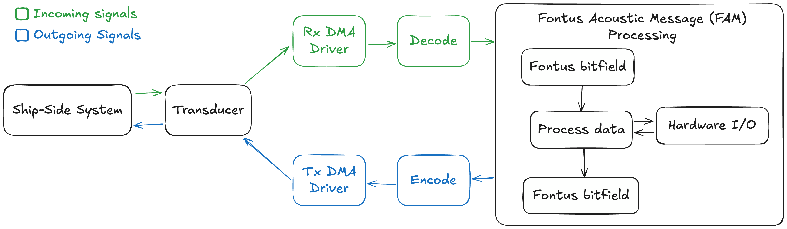

# Dataflow
The WhisperTrack acoustic modem implements a bidirectional data flow for underwater communication between a ship-side system and the transducer.
## Ship-Side System
The external system that generates acoustic signals for underwater communication with the modem.
## [Transducer](../assets/images/software/transducer-single-bit.jpg)
Converts between acoustic signals and electrical signals. Receives acoustic waves from the ship and converts them to electrical signals for processing, and converts electrical signals to acoustic waves for transmission.
## [Rx DMA Driver](../assets/images/software/dma-message.jpg)
Captures the digitized 1-bit signal from the comparator at 64 kHz. Packs 32 single-bit samples into 32-bit words using circular DMA transfers. Signals the Fontus processor when half or full buffers are ready.
## Decode
Processes the raw digital samples through the Fontus RX state machine. Performs wake detection, doppler measurement, matched filtering, and demodulation to extract the message data.
## [Fontus Acoustic Message Processing](../assets/images/software/fam.jpg)
Core modem engine that implements the [Fontus acoustic protocol](../software/fontus-spec.md). Contains the process data logic, hardware I/O interfaces, and Fontus bitfield structures for message handling. More details can be found on the [Fontus Acoustic Messages](../software/fontus-acoustic-messages.md) page.
## Encode
Implements the Fontus TX state machine to generate wake chirps, doppler chirps, and BFSK-modulated data as 16-bit PCM samples.
## Tx DMA Driver
Transfers the encoded waveform data to the DAC at 64 kHz using timer-triggered DMA. Manages transmit buffer for complete message transmission.

## Flow Diagram
